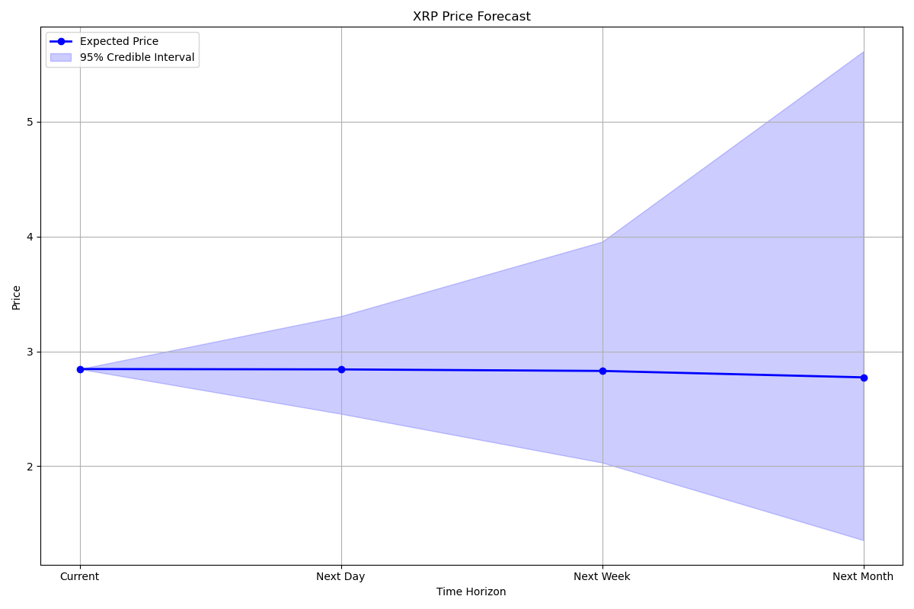

# XRP Trading Analysis Report

## Executive Summary
Based on Bayesian MCMC analysis of historical price data, the following insights and recommendations are generated:

### Key Findings
- **Expected Daily Return:** -0.001174 (-0.1174%)
- **Daily Volatility:** 0.054458 (5.4458%)
- **Probability of Positive Return:** 49.0%
- **Risk Level:** MEDIUM
- **95% Credible Interval for Mean Return:** [-0.088468, 0.089940]
- **95% Credible Interval for Volatility:** [0.052907, 0.056111]
- **95% Predictive Interval for Next-Day Return:** [-0.142885, 0.149794]

### Price Forecasts (95% Credible Intervals)
Current Price: 2.846700

| Time Horizon | Expected Price | Lower Bound | Upper Bound | Range |
|--------------|---------------|-------------|-------------|--------------|
| Next Day | 2.843359 | 2.456634 | 3.307050 | 0.850415 |
| Next Week | 2.830034 | 2.031845 | 3.955332 | 1.923487 |
| Next Month | 2.774094 | 1.356092 | 5.613021 | 4.256929 |

## Trading Recommendation

### Signal: NEUTRAL (LOW Confidence)

**Recommendation:** Hold current positions or consider a neutral strategy.

- Consider allocating 22.5% to long positions and 22.5% to short positions.
- Alternatively, await stronger directional signals before entering new positions.

### Short-Term Strategy Based on Price Forecast

The expected price movement for tomorrow is relatively small (-0.12%). Consider focusing on range-bound trading strategies or accumulating positions at favorable prices within the predicted range.

The predicted price range for tomorrow spans 29.87% of the current price, which suggests significant intraday trading opportunities.

## Detailed Analysis

### Return Distribution
The analysis of historical returns shows an expected daily return of -0.001174 with a volatility of 0.054458. The 95% credible interval for the mean return contains zero, indicating uncertainty about the true direction of returns.

### Volatility Analysis
The estimated volatility of 0.054458 indicates moderate levels of price fluctuation. Standard risk management practices are advised.

### Prediction for Next Trading Day
Based on the posterior predictive distribution, there is a 49.0% probability of a positive return on the next trading day. The 95% predictive interval for the next-day return is [-0.142885, 0.149794].

### Extended Time Horizon Predictions

**One-Week Outlook:** The expected price after one week is 2.830034, representing a -0.59% change from the current price. The 95% credible interval for the one-week price is [2.031845, 3.955332].

**One-Month Outlook:** The expected price after one month is 2.774094, representing a -2.55% change from the current price. The 95% credible interval for the one-month price is [1.356092, 5.613021].

These extended forecasts become increasingly uncertain with time horizon. The predictions incorporate both parameter uncertainty and random market movements, resulting in wider intervals for longer horizons.

### Risk Assessment
The current risk level is assessed as MEDIUM, based on the estimated volatility and uncertainty in return predictions. This suggests standard position sizing and stop-loss practices.

## Methodology
This analysis uses Bayesian inference with Rejection Sampling to estimate the posterior distributions of mean return and volatility. The rejection sampling algorithm draws candidates from proposal distributions and accepts them based on the ratio of the posterior to the proposal density. This method provides exact samples from the posterior distribution but can be less efficient than Gibbs sampling for high-dimensional problems. The posterior predictive distribution incorporates both parameter uncertainty and inherent market randomness.

For multi-period forecasts (weekly and monthly), the analysis simulates multiple daily returns using random draws from the posterior predictive distribution and compounds them to generate price paths. The reported intervals represent the 95% credible range of these simulated paths.

## Limitations and Disclaimers
1. This analysis is based solely on historical price data and does not incorporate fundamental factors, news events, or market sentiment.
2. Past performance is not indicative of future results. Financial markets are complex systems subject to numerous influences.
3. This report is generated automatically and should be used as one input among many for trading decisions.
4. The model assumes returns follow a relatively stable distribution, which may not hold during market regime changes.
5. Longer-term forecasts are subject to increasing uncertainty and should be interpreted with appropriate caution.

## Report Generation
This analysis was generated automatically on 2025-10-19 15:35:39 based on available historical data.